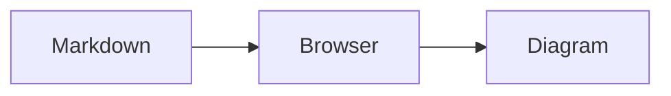

# serve-md

`serve-md` starts a local web server for browsing Markdown files in a directory tree.

## Install

Go 1.24 or later is required.

```sh
go install github.com/flexdinesh/serve-md@latest
```

Serve the current directory:

```sh
serve-md .
```

Press <kbd>Command</kbd>+<kbd>K</kbd> on macOS or <kbd>Ctrl</kbd>+<kbd>K</kbd> elsewhere to search Markdown file paths and contents in the browser.

## Mermaid diagrams

Fenced `mermaid` blocks render as read-only Excalidraw canvases by default and follow your system's light or dark theme:

````markdown

````

Supported diagrams become native Excalidraw shapes. Unsupported conversions and rendering failures leave the source visible with a short error. Canvases load only as they approach the viewport.

Use the tldraw renderer at server boot:

```sh
serve-md . --feature mermaid-tldraw
```

tldraw supports native flowcharts, sequence diagrams, state diagrams, and mindmaps, with other valid Mermaid types rendered as static SVGs on its canvas.

`--feature` is repeatable. Unknown feature names fail startup. The server exposes the effective browser flags at `GET /api/features`; flags stay fixed for the server process.

Diagram code bundles React 19.2.1, tldraw 5.4.0, `@tldraw/mermaid` 5.4.0, Excalidraw 0.18.1, and `@excalidraw/mermaid-to-excalidraw` 2.2.2. Excalidraw fonts are embedded locally. tldraw fonts and assets still require internet access and load from tldraw's CDN.

## Development

See [docs/development.md](docs/development.md) for the web development workflow and feature flags.

Frontend development requires Node.js 26 and pnpm 11. Node-run code uses native TypeScript; React uses Vite TypeScript. Only generated browser bundles in `internal/web/dist` remain JavaScript.

Install dependencies:

```sh
go mod download
pnpm install
pnpm exec playwright install --with-deps chromium
```

Run the Go, frontend unit, and browser tests:

```sh
go test ./...
pnpm test:web
pnpm test:browser
pnpm typecheck
```

Committed Markdown fixtures in `testdata/markdown` are shared by Go and browser tests. They are also the default development content, including nested documents, search content, GFM, links, and Mermaid diagrams.

The browser UI is a React app built with Vite. Generated files in `internal/web/dist` are committed and embedded in the Go binary. Regenerate them after frontend changes:

```sh
pnpm build:web
```

Run the Go API and Vite dev server together against the fixture content:

```sh
pnpm dev
```

Both development servers listen on all IPv4 interfaces. Their startup output lists localhost, `0.0.0.0`, and one available LAN IPv4 URL with the selected ports. This exposes the unauthenticated development servers and served Markdown to attached networks.

Outside SSH sessions, Vite and the Go CLI open their localhost URLs in the default browser. The `dev:go` script passes `--no-open`, so `dev` opens only Vite. Set `--no-open` when running the Go command directly to disable its browser launch.

To run either server independently, use separate terminals:

```sh
pnpm dev:go
pnpm dev:vite
```

`dev:vite` expects `dev:go` to be running and proxies API requests to it.

Build and run locally:

```sh
go build -o ./bin/serve-md .
./bin/serve-md .
```

Build the browser UI and install the local CLI to your Go binary directory:

```sh
pnpm link:local
```

## License

MIT
