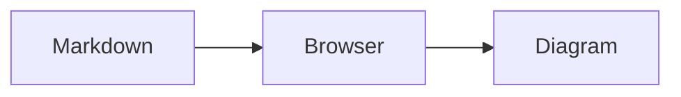

# serve-md

`serve-md` starts a local web server for browsing Markdown files in a directory tree.

## Install

Go 1.24 or later is required.

```sh
go install github.com/flexdinesh/serve-md@latest
```

Serve the current directory:

```sh
serve-md .
```

Press <kbd>Command</kbd>+<kbd>K</kbd> on macOS or <kbd>Ctrl</kbd>+<kbd>K</kbd> elsewhere to search Markdown file paths and contents in the browser.

## Mermaid diagrams

Fenced `mermaid` blocks render as read-only tldraw canvases and follow your system's light or dark theme:

````markdown

````

Flowcharts, sequence diagrams, state diagrams, and mindmaps become native tldraw shapes. Other valid Mermaid diagram types fall back to a static SVG on the canvas. Pan with the canvas and use the −, Fit, and + controls to adjust zoom. Canvases load only as they approach the viewport. If loading or rendering fails, the source stays visible with a short error.

Diagram code bundles React 19.2.1, tldraw 5.4.0, `@tldraw/mermaid` 5.4.0, and its Mermaid 11.16.1 dependency. tldraw fonts and assets require internet access and load from tldraw's CDN. `@tldraw/mermaid` uses Mermaid internally for parsing and layout.

## Development

Frontend development requires Node.js 20.19 or later and pnpm 11.

Install dependencies:

```sh
go mod download
pnpm install
```

Run the Go and browser tests:

```sh
go test ./...
pnpm test:web
```

The browser UI is a React app built with Vite. Generated files in `internal/web/dist` are committed and embedded in the Go binary. Regenerate them after frontend changes:

```sh
pnpm build:web
```

For frontend development, run the Go API and Vite dev server separately:

```sh
go run . . --port 8080 --no-open
pnpm dev:web
```

Build and run locally:

```sh
go build -o ./bin/serve-md .
./bin/serve-md .
```

Install the local binary to your Go binary directory:

```sh
go install .
```

## License

MIT
