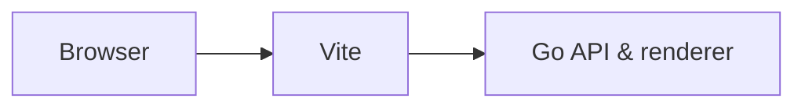
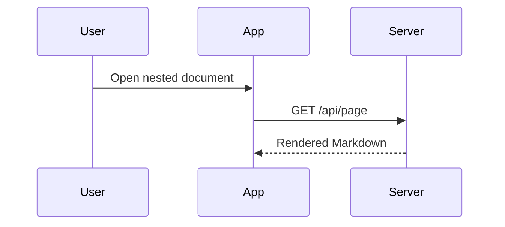

# Mermaid diagrams

## Request flow

```mermaid
flowchart LR
    Browser --> Vite
    Vite --> GoAPI["Go API & renderer"]
```

## Page load

```mermaid
sequenceDiagram
    participant User
    participant App
    participant Server
    User->>App: Open nested document
    App->>Server: GET /api/page
    Server-->>App: Rendered Markdown
```

